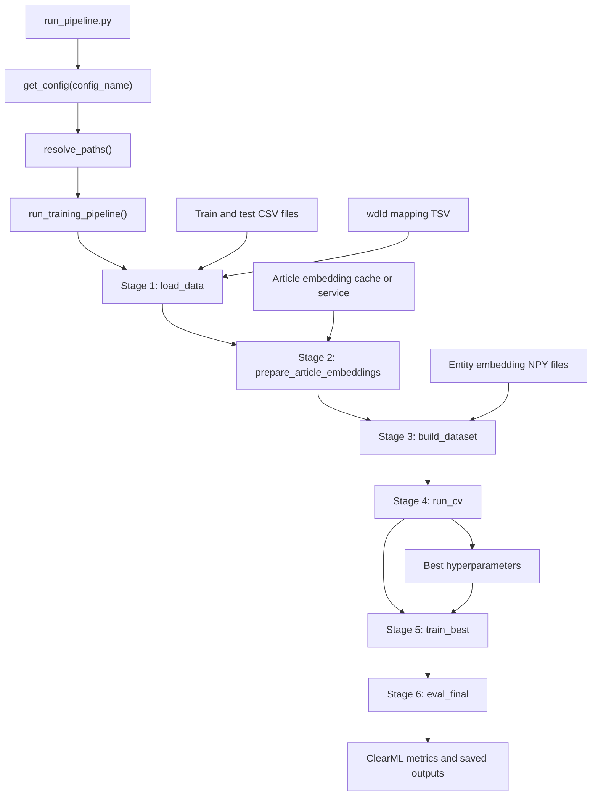

# IPTC Entity-Enhanced Pipeline

This document explains the ClearML pipeline started by
`src/iptc_entity_pipeline/run_pipeline.py`. The pipeline trains and evaluates a
multi-label IPTC classifier using article embeddings, linked Wikidata entity
embeddings, or both, depending on the selected config variant.

## Entry Point

Run the pipeline from the repository root:

```bash
python3 src/iptc_entity_pipeline/run_pipeline.py --local --config debug
```

The script:

1. Parses CLI arguments in `src/iptc_entity_pipeline/run_pipeline.py`.
2. Loads a named dataclass config from `src/iptc_entity_pipeline/config.py`.
3. Calls `run_pipeline()` in `src/iptc_entity_pipeline/pipeline.py`.
4. Resolves paths relative to the current working directory.
5. Starts the ClearML-decorated pipeline `run_training_pipeline()`.

Use `--local` when developing or debugging. Without `--local`, ClearML dispatches
the pipeline controller to the `iptc_entity_pipeline` queue and component tasks
to the `iptc_entity_tasks` queue.

## Pipeline Diagram



## Pipeline Stages

### 1. Load Data

Component: `load_data`

The pipeline loads the train and test CSV files, normalizes IPTC categories,
removes configured category IDs, optionally downsamples training corpora, loads
the Geneea-to-Wikidata mapping, and attaches linked entities to each article.

Default inputs are configured in `PathsCnf`:

- `data/gold-chrono-per-dataset/all-corpora-train-entities.csv`
- `data/gold-chrono-per-dataset/all-corpora-test-entities.csv`
- `data/gold-chrono-per-dataset/wdId_mapping.tsv`
- `data/downsampling_order_cache.json`

### 2. Prepare Article Embeddings

Component: `prepare_article_embeddings`

If `emb.use_article_embeddings` is enabled, article vectors are prepared for the
train and test corpora. Existing vectors are reused from `data/article_embeddings`.
Missing vectors are computed through the configured embedding service.

Important defaults:

- Article model: `paraphrase-multilingual-MiniLM-L12-v2-300-0.3`
- Embedding dimension: `384`
- Embedding service URL: `http://tau.g:5533`

For entity-only configs, this stage is skipped and returns empty stats.

### 3. Build Dataset

Component: `build_dataset`

This stage creates the actual model input matrices. Depending on config, it may
use article vectors, entity vectors, or a concatenation of both.

For entity features, the pipeline:

- Selects one or more entity embedding languages.
- Loads vectors from `data/entity_embeddings/...`.
- Pools all linked entity vectors per article.
- Combines the pooled entity vector with the article vector when both are enabled.
- Converts the resulting matrices into the legacy `EmbeddingDataset` format.

The default entity pooling is `sum`, and the default article/entity combination
method is `concat`.

### 4. Cross-Validation

Component: `run_cv`

Cross-validation is mandatory. The pipeline prepares labels from the train data,
runs the configured Optuna search over the hyperparameter space, evaluates each
candidate across folds, reports fold/trial curves to ClearML, and selects the
best model/training configuration by the configured objective row.

Default CV setup:

- Folds: `5`
- Random seed: `43`
- Sampler: `grid`
- Objective: `All-datapoint`

### 5. Train Final Model

Component: `train_best`

The final model is trained on the full train dataset using the best
hyperparameters from cross-validation. The test dataset is passed as the
validation split for final training logs and curves.

The model architecture and training loop are implemented through the reused
legacy IPTC training path, wrapped by `src/iptc_entity_pipeline/training.py`.

### 6. Evaluate and Save Outputs

Component: `eval_final`

The final model is evaluated on the test dataset. The pipeline reports aggregate
and per-class metrics to ClearML, writes evaluation tables, optionally compares
against a baseline run, and saves the final model bundle.

Saved outputs are written under:

```text
results/saved_models/<config_name>_<timestamp>/
```

The output directory contains:

- `model.nn.bin`
- `test_embeddings.tsv`
- `iptc.config.yaml`
- `pipeline_parameters.json`
- `predictions.pkl`
- `eval_corpus.pkl`
- `final_evaluation_tables_<config_name>.xlsx`

## How to Run

Install the package and dependencies first:

```bash
python3 -m venv .venv
source .venv/bin/activate
pip install -e .
```

Make sure the Geneea packages, ClearML credentials, data files, article embedding
service, and entity embedding files are available in the environment.

Run a small debug pipeline locally:

```bash
python3 src/iptc_entity_pipeline/run_pipeline.py --local --config debug
```

Run the default entity-enhanced config locally:

```bash
python3 src/iptc_entity_pipeline/run_pipeline.py --local --config wpentities
```

Run an ablation experiment:

```bash
python3 src/iptc_entity_pipeline/run_pipeline.py --local --config article_only
python3 src/iptc_entity_pipeline/run_pipeline.py --local --config entity_only
```

Run through ClearML queues:

```bash
python3 src/iptc_entity_pipeline/run_pipeline.py --config wpentities
```

For queued execution, start ClearML agents for both queues:

```bash
env CLEARML_AGENT_SKIP_PIP_VENV_INSTALL=/home/prokop/Git/entity-enhance-classification/venv/bin/python \
  clearml-agent daemon --queue iptc_entity_pipeline --detached

env CLEARML_AGENT_SKIP_PIP_VENV_INSTALL=/home/prokop/Git/entity-enhance-classification/venv/bin/python \
  clearml-agent daemon --queue iptc_entity_tasks --detached
```

Stop ClearML agents when needed:

```bash
clearml-agent daemon --stop
```

## Config Variants

Common config names:

- `debug`: small debug data under `data/debug`.
- `wpentities`: default article plus Wikidata entity embeddings.
- `article_only`: article embeddings only.
- `entity_only`: entity embeddings only.
- `wpentities_all_langs`: entity embeddings for all supported languages.
- `wpentities_en_nl`: English and Dutch entity embeddings.
- `wpentities_nl`: Dutch entity embeddings only.
- `wikipedia2vec_entities`: Wikipedia2Vec entity embedding directory.
- `wikipedia2vec_entities_all_langs`: multilingual Wikipedia2Vec embeddings.
- `wikidata_description_entities`: Wikidata description embeddings.
- `best_wpentities`: narrowed best-known hyperparameter space for entity-enhanced runs.
- `best_article_only`: narrowed best-known hyperparameter space for article-only runs.

Print all supported names from the CLI help:

```bash
python3 src/iptc_entity_pipeline/run_pipeline.py --help
```

## Troubleshooting

- If both `use_article_embeddings` and `use_entity_embeddings` are disabled, the
  pipeline fails fast because no input features can be built.
- If article embeddings are missing, the embedding service at `emb.embed_svc_url`
  must be reachable unless the selected config disables article embeddings.
- If entity embeddings are missing, check that files exist under the selected
  `paths.entity_embeddings_dir` and follow the expected `{QID}_{lang}_{chunk}.npy`
  naming convention.
- Run from the repository root so relative path resolution and package imports
  match the expected project layout.
- The CLI currently accepts `--task-name`, but the parsed value is not passed into
  the ClearML pipeline; the decorated pipeline name is `iptc-entity-enhanced-v1`.
